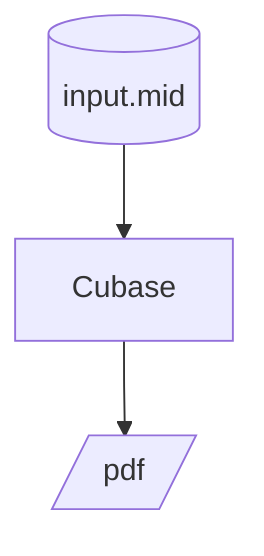
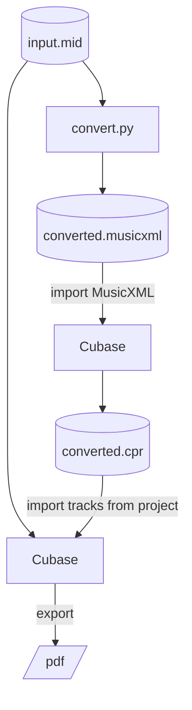

## Workflow

# without xf-tools

```mermaid
flowchart TD;
    1[(input.mid)] --> 2[Cubase] --> 3[/pdf/]

```

# with xf-tools

```mermaid
flowchart TD;
    1[(input.mid)] --> 2[Cubase] --> |export|10[/pdf/];
    1 --> 3[convert.py] --> 4[(converted.musicxml)] --> |import MusicXML|5[Cubase] --> 6[(converted.cpr)];6 --> |import tracks from project|2[Cubase]
```
